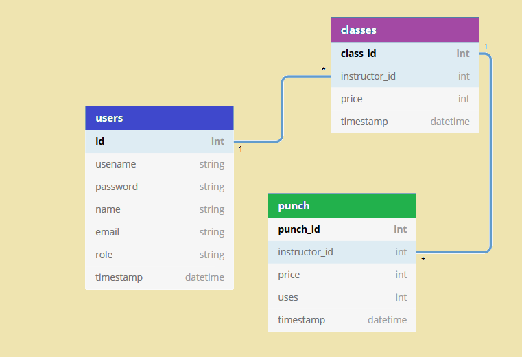

# Air Fitness Backend
An easy to use app for open space fitness classes. Giving instructors and clients the ability to manage their classes from their phone. Clients can search for classes in their specific area. Instructors now have a platform where they are not bound to holding classes at facilities and can take their classes into their own hands.

# Project Goals
1. Onboarding for a new client and fitness instructor
2. Class and punch cards are intwined so clients now have 10 passes to each class upon class purchase
3. Ability to easily create / setup a class time
4. Ability to easily edit / delete a class 
5. Ability for client to create an account and purchase a 10 class punch pass from an instructor.
7. Punch pass updates for client as it’s used.
8. Integrate PayPal as a payment method. Ability for instructor to add people to a 'class 

#  Frameworks / Libraries
bcrypt bcryptjs cors dotenv express faker helmet jsonwebtoken knex knex-cleaner pg sqlite3 jest nodemon supertest

# Schema

pending

# RESTful API end points

GET
List of users
 ```/api/users```
 List of classes
 ```/api/class```
POST
Login 
```/api/user/login```
Register 
```/api/users/reg```

more coming soon

